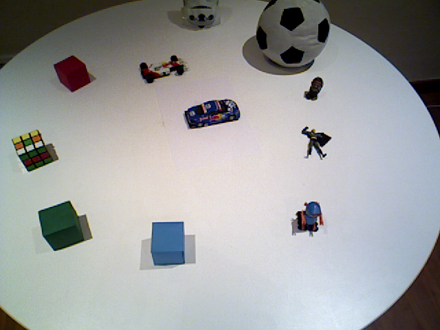
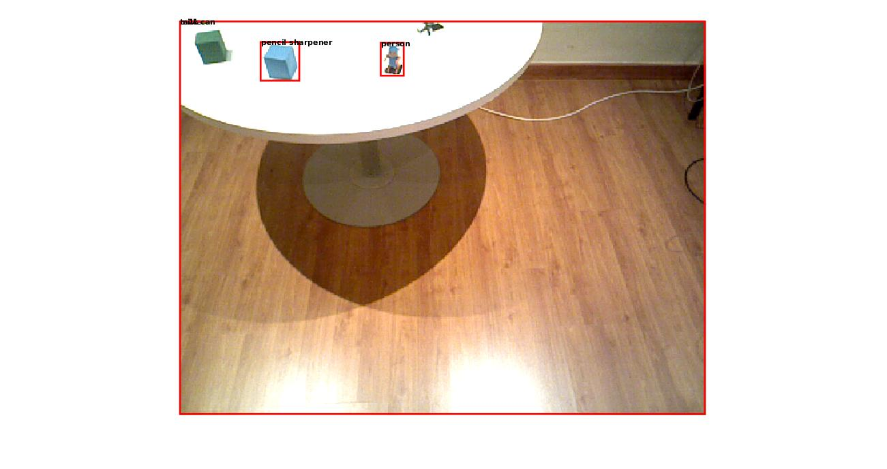
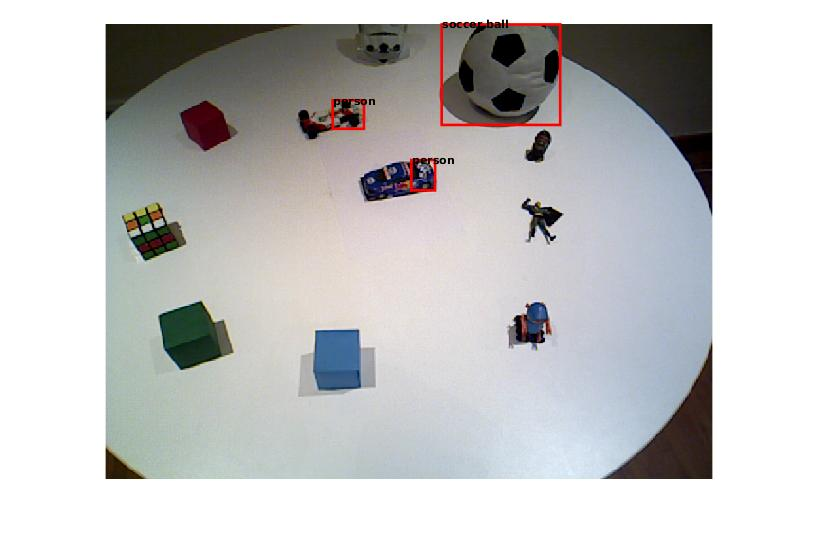
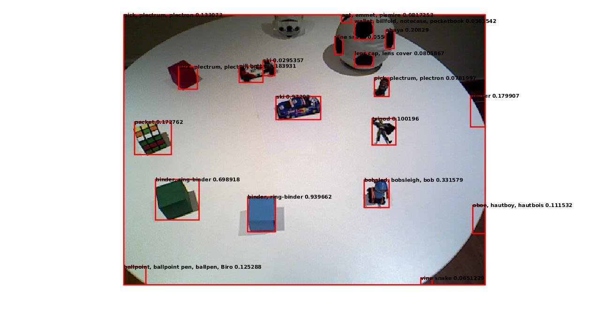
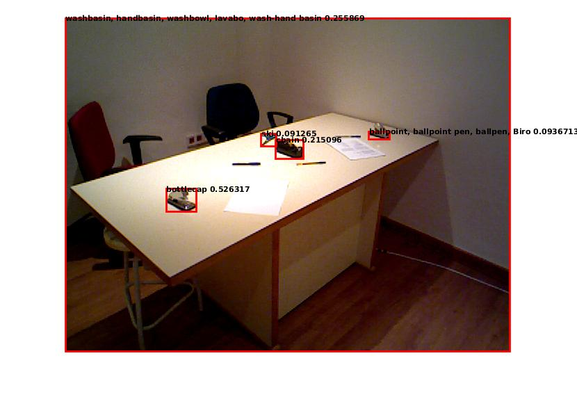
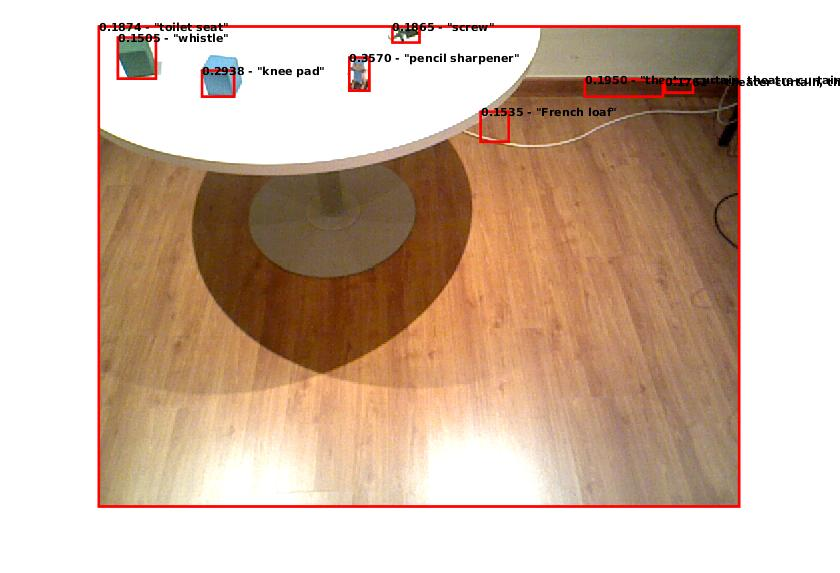
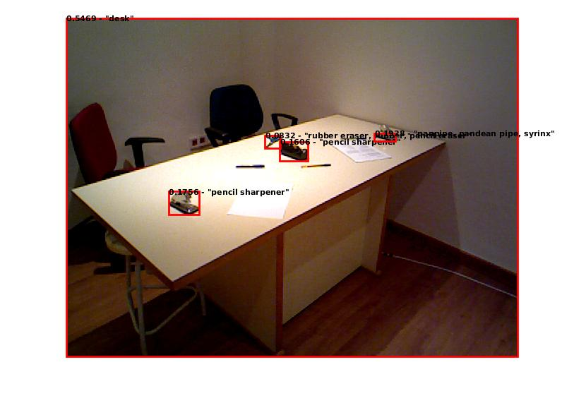
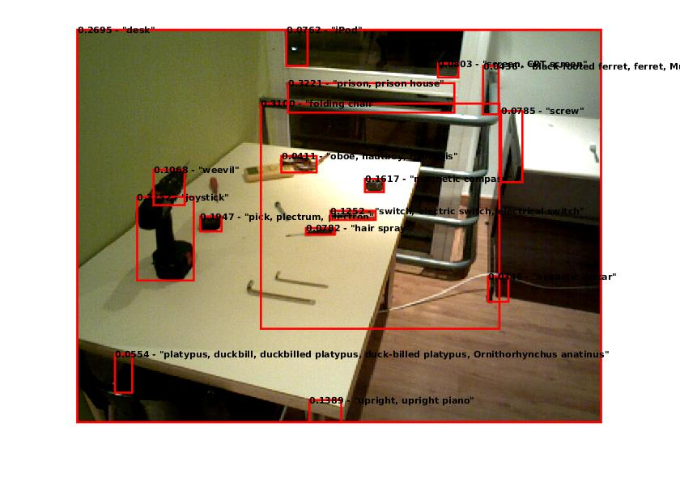

Is CNN solution to every object classification problem?
============
Given the hype about CNNs and how they outperform the state-of-art object classifiers it would be interesting to see how they perform on images of day-today objects placed o a table . Figure 1 shows sample images given to CNN for classification. Although being a simple non-cluttered object identification problem, it is a non-trivial and challenging for vision tasks. Because, the the resolution is low and and objects are small. CNNs are good classifiers for a primary object in the scene i.e. we need to extract the object before giving it to a CNN. So let’s manually crop every object and give it to CNN and see how it performs. I have used 2 state-of-art CNNs. One is VGG16 by Oxford research group and the other is Overfeat by CILVR Lab @ NYU. I tried to qualitatively analyse the performance of both networks using top and top-5 classification results. I found that the performance is not very good for top-result, however the performance is acceptable for top-5 results.

Figure 1: Settings we are interested to work with. A table with some objects. 

How to handle Object detections?
============
Object detection task is different from classification task. In detection task it is required to identify where the object is in the given image compared to the classification task where given the image identification of the object’s category is required. Recently, object detection has gained lots of interest in the vision community. At present there exists NN based solutions like Segnets, FCN which do pixelwise segmentations, also there is RCNN which proposes bounding box for an object. Now several such bounding boxes are given to the classifier for category identification. Here I have used a top-hat filter for object detection and compared with RCNN. The basic idea is that for objects there is intensity difference from the table so that the object could be discriminated from table by a top-hat filter. From figure 2. It could be seen that top-hat gives better object proposals than RCNN. Note that I have used existing pre-trained networks thus the cliam will not hold if I retrain RCNN on our dataset.
So we indeed require training. 

 
    
    
Figure 2: Object detection results form RCNN(row 1) compared to my object proposel fed to Overfeat(row 2) and VGG16 (row3) for sample images.

Next steps
============
Next I will use RCNN and train on our dataset or another approach is to use better object proposal algorithms like BING, GOP, Selective search (RCNN uses selective search) and evaluate the performance.

----------------
Harit Pandya
