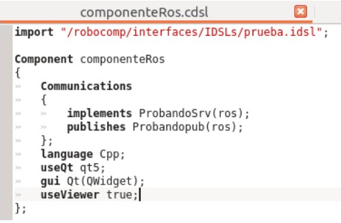

Hi! I am back.
It's been weeks since my last post, because there was not much to say. In this post I will summarize the progress with RoboCompDSL.
Now I finished the biggest work, we can communicate two Robocomp components using ROS middleware or ICE middleware and it is as simple as has been done so far. We just need write an IDSL(s) with some restrictions and a CDSL for our component.

**What restrictions?**
**Services** has two parameters (in/out).
Example: void service(int numRequest, out int numResponse);
**Topics** has just one parameter.
Example: void topic(int numToPublish);
**Allowed Types** are structs, sequences(array) and primitives types as string, int, float...

Paying attention to this restrictions we can write an IDSL compatible with ROS and ICE middleware for our components. I am working on a guide to explain all the news and how to use them.

Finally I would like to highlight a further set of additions that I made:

**Written a Syntax Highlighting File** that allow in KDE applications results like:

  

**Support QT5** completed and tested (an example of use in the image above).